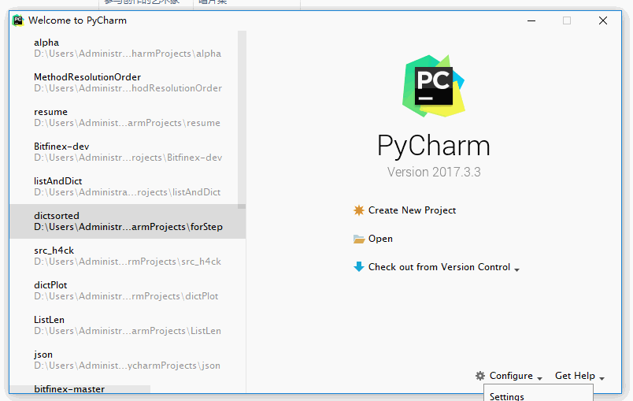
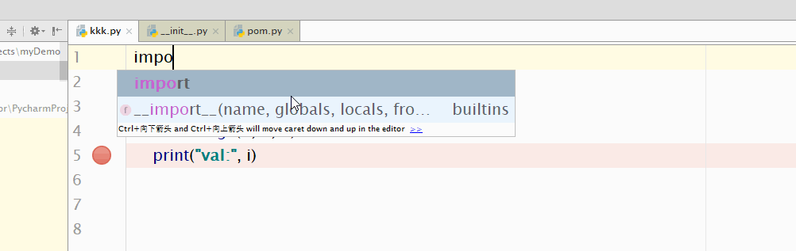

# 用pycharm快速入门Python

>很多时候我们会对一些事情突然感兴趣啊，比如学游戏编程，学烘焙，中午想去吃辛拉面等等。 有的事情可以短时间去做完的，比如吃拉面，这样它被成功执行的机会就比较高。然后做一个小游戏/烘焙，需要做一些前期的准备，eg.环境的搭建，材料的准备。这个过程容易消磨人的兴趣，影响计划的实现。 
>
>所以写这个manual是为了让那些想接触python的人，可以快速上手。减少琐碎的配置带来的负面影响。
>
>如果你已经有python基础了那搭配《[Think python](像计算机科学家一样思考Python)》这本书做练习就好了。这个文档主要讲一些环境的配置。

## 安装IDE

假设我们是在Windows系统下配置。所有的软件都安装到默认路径。

需要安装**Pycharm**和**Python 3.x**

- 我们用Pycharm作为IDE, 先不管为什么选这个IDE, 先上手再说。--> [Pycharm 下载](http://www.jetbrains.com/pycharm/)

- Pycharm有点像加强版的文本编辑器，所以说到底还是不能执行Python的。
所以我们还要安装Python的解释器，解析器可以运行python脚本。 参考这个文章中的python和pip安装小节-->
[windows 10环境下安装Python3和PyQt](https://www.jianshu.com/p/736ec5d6bd67)

- 激活pycharm
用lucyking/lucyking激活

## 开始写代码

- 写完代码就可以运行了， 运行之前先在[Settings]中看一下解释器有没有配置好。第一次运行是灰色的，可以通过菜单栏[Run]->[Run...]->[myDemo.py]运行myDemo.py

- 调试： 
	- 可以修改变量然后查看对程序的运行影响。
	- 或者用debug动态调试。在条件允许的前提下，动态调试更有效率，Pycharm会把变量实时显示在代码后面。

## 共产主义写代码
- 一个人写代码是茹毛饮血的原始操作。很多时候你需要实现一个功能，星球上的另一个人也要实现这个功能。可是你们又不认识，没有办法沟通。那么就可能导致你们两个人，各自做了重复的劳动。有没有方法避免这个劳动？有的，那就是开源社区和开源库。

- **基本库**：有的库是系统内置的，可以直接import,比如math库，包含了很多数学相关的基础操作：

- **第三方库**：大家也会把常用的代码封装成python库，然后像安装软件一样通过**pip**这个工具安装。安装完就可以直接调用了，节省了很多时间。 也可以把自己的代码传到python官网，然后就能给大家下载了。

- 一个例子：
	- 假设我想知道知道现在月亮的盈亏
	- 这个程序已经有人写好了，叫做[bsdgames](https://github.com/lucyking/python-bsdgames)。那我们就只需pip安装一下就可以用啦。具体操作参见README。（这个库目前只支持python2.x）

## 基础入门书籍

- 可以看《[Think python](像计算机科学家一样思考Python)》这本书，试着把里面的代码敲到IDE里亲自运行调试一下。这本书比较薄，不要看它的题目起得很厉害，其实内容通俗易懂，看完就入门啦。
- 看编程书就看动物书吧，不要看国内的辣鸡书， 写得很啰嗦， 可能会浪费你的时间。

## 进阶练习与提升
- 在[leetcode](https://leetcode.com/)上做题，通过刷题能快速地迭代和提升编程技巧。这些问题都是实际问题的抽象， 多刷题能开阔解决实际问题的思路。
- Github上有很多好的python项目，可以通过**筛选项目语言**和**按照star排序**来快速找到你需要的库（因为优秀的库一般都star多），平时有什么需求可以先搜下有没有现成的库哈哈：

## More details

- 编程语言分解释型和编译型，解释型就是说程序逐条被解析和执行，省略了编译这个步骤。
- Python有分为2.x和3.x版本的，2.x过几年官方就不支持了，那就用3.x。
- bsdgames中的pom是根据这本书写的： 《[Practical Astronomy with Your Calculator](https://book.douban.com/subject/2880048/)》
- python程序的调试：《[当你在自动化测试的时候你用什么来Debug](http://gitbucket.blog.163.com/blog/static/25869806620162161146528/)》
- 很多问题都可以通过百度解决的，如果你搜不到可能是关键字给得不够有技巧，请多锻炼搜索技巧，能找到大部分的答案。有的问题找不到答案可以试试Google和StackOverflow. >>>[谷歌语法搜索](https://book.douban.com/subject/3676292/)。
- 保证英语在轻松阅读文档以上，有外文官方文档就不要看翻译版。